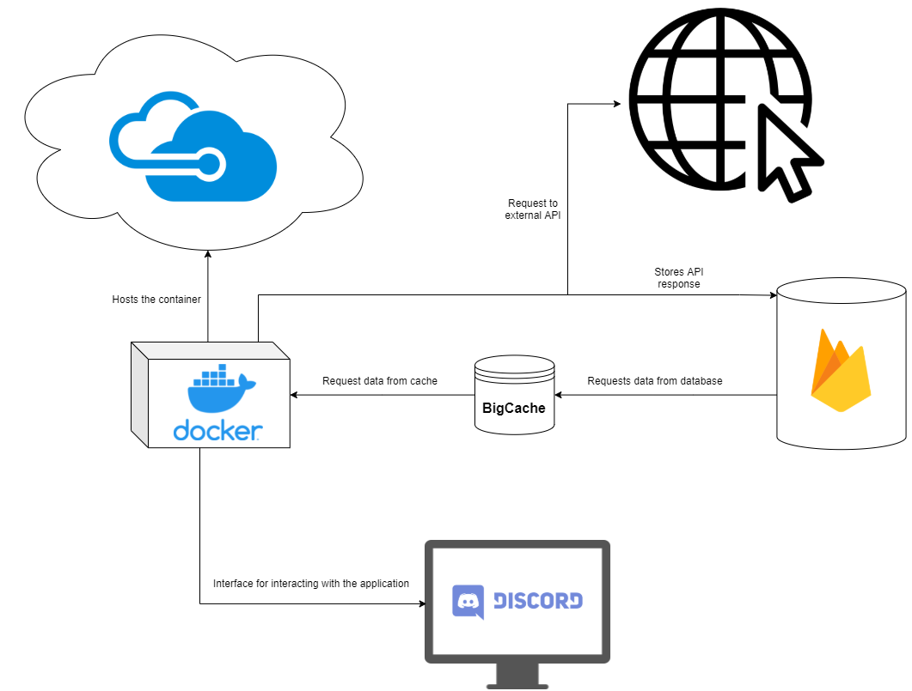
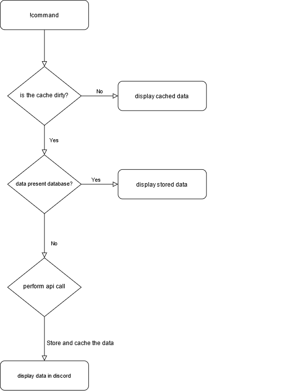

# Architecture
This document serves an explanatory nature of trying to convery the components of our system in a digestable way. As well we have created a systems diagram and a run through the flow of a call in the program.

## components/dependencies
### Firebase 
    - Used for storage of api call responses.
### Discordgo
    - golang binding for discord api
### Microsoft azure
    - used for hosting our deployed web service
### Gocacheable
    - abstracts the call to the BigCache and makes it easier to handle cache when calling functions.
### Azure Database MySQL
    - used to store Todo list per user in the discord channel
### Docker
    - utilized to deploy the discord bot to Azure container registry

## Architecture diagram

## control flow of an operation

